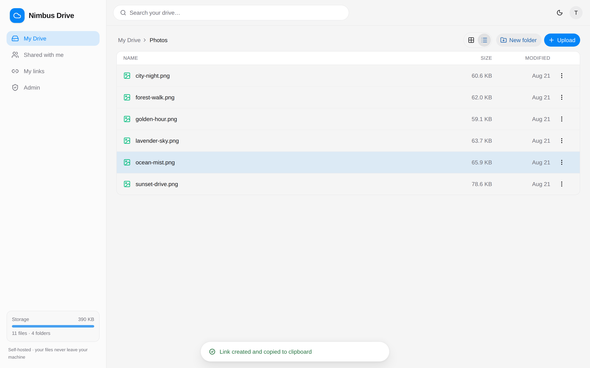
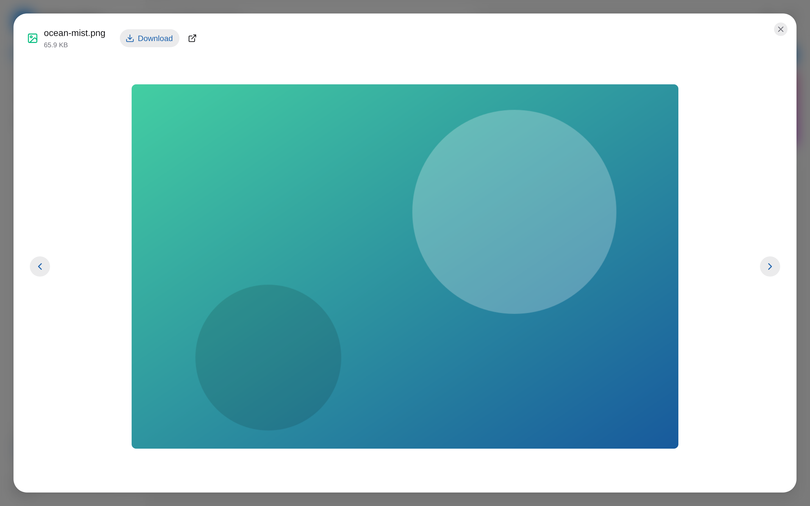
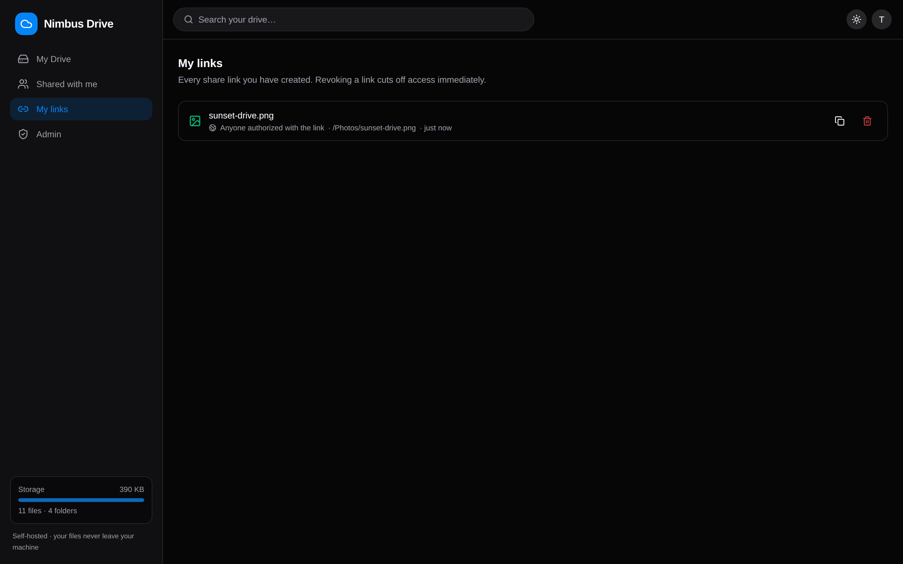
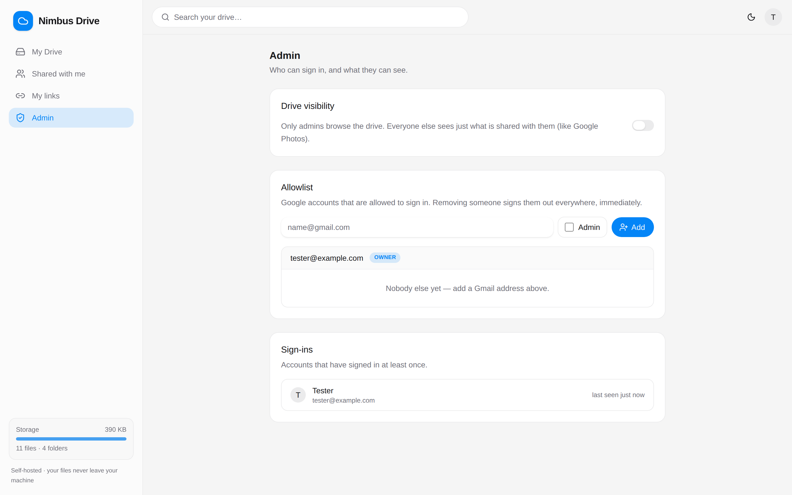
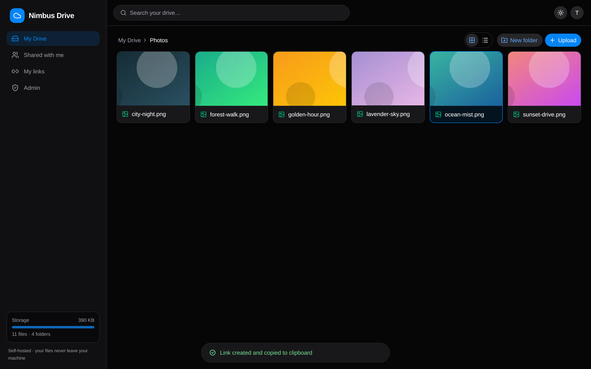

<div align="center">

# ☁️ Nimbus Drive

**Your personal self-hosted cloud — running on your computer, storing files on your disk, accessible from anywhere.**

[](https://github.com/MoaazMustafa/nimbus-drive/releases/latest)
[](DESKTOP.md)
[](https://nodejs.org)
[](https://nextjs.org)
[](https://expressjs.com)
[](https://cloudflare.com)
[](LICENSE)

<br />


</div>

---

## 🌟 Overview

**Nimbus Drive** transforms any folder on your computer into a private, self-hosted cloud drive accessible securely from your browser, phone, or desktop. It combines the sleek user experience of modern cloud storage with total ownership of your data—no cloud subscription fees, no third-party storage lock-in, and zero public exposure.

---

## ✨ Features at a Glance

- 📁 **Files Live on Your Local Disk:** Serves a standard folder (`STORAGE_ROOT`). Drop files directly into your OS Explorer or Finder, and watch them instantly sync with the web UI via live file-watchers.
- 🔒 **Google OAuth & Allowlist Protection:** Zero passwords to manage. Users sign in with Google OAuth, and access is granted strictly to accounts on your custom **Allowlist** managed in the Admin panel.
- 🔗 **Public Sharing Links:** Turn any file or folder into a shareable link that anyone can open without signing in. Features optional expiration dates, view/download restrictions, and instant revoking.
- 🖥️ **Zero-Terminal Windows Desktop App:** A single-click installer (`Nimbus-Drive-Setup.exe`) that manages its own Node.js runtime, supervises processes, auto-restarts on boot, and updates directly from GitHub Releases with one-click rollback support.
- 🎬 **Rich In-Browser Media Previews:** Instant streaming for video (with seeking), audio playback, PDF viewing, image galleries, and code/text editing.
- 🗑️ **Safe Trash & Restore System:** Deleting items moves them to a recoverable **Trash** area. Restore items to their original location or purge permanently when ready.
- 🛡️ **Admin Audit & Activity Logs:** Complete visibility into user logins, uploads, downloads, previews, renames, moves, and deletions with timestamps and IP logging.
- 📱 **Installable PWA & Dark Mode:** Fully responsive interface featuring automatic dark mode detection, custom glassmorphic styling, and PWA installation for mobile and desktop screens.

---

## 🏗️ Architecture & Tech Stack

Nimbus Drive runs as a lightweight two-tier architecture connected via a Cloudflare Tunnel for secure, portless HTTPS access:

```
┌─────────────────┐       HTTPS       ┌──────────────────┐    proxy    ┌─────────────────┐
│   Any Device    │ ────────────────► │  Next.js Web UI  │ ──────────► │   Express API   │
│ (Phone/Desktop) │  Cloudflare       │   Port :3000     │   /api/*    │   Port :4400    │
└─────────────────┘  Named Tunnel     └──────────────────┘             │  ├ SQLite DB    │
                                                                       │  ├ Chokidar     │
                                                Your Local PC ────────►│  └ STORAGE_ROOT │
                                             (Native Explorer)         └─────────────────┘
```

* **Frontend:** Next.js 16 (App Router), HeroUI, TailwindCSS, Lucide Icons, SWR.
* **Backend:** Node.js 20+, Express 5, `better-sqlite3`, `chokidar` (live file watching), `sharp` (thumbnail processing).
* **Network & Security:** Cloudflare Tunnels (named HTTPS tunnel without port forwarding), Google OAuth 2.0.
* **Desktop Core:** Electron process supervisor with automated blockmap updates and GitHub release management.

---

## 📸 Screenshots Showcase

<details>
<summary><b>🖼️ Click to view Nimbus Drive Screenshots</b></summary>

<br />

| Drive Grid View | List & Multi-Select View |
| :---: | :---: |
|  |  |

| Media & Document Preview | Public Links Management |
| :---: | :---: |
|  |  |

| Admin Allowlist & Activity Logs | Dark Mode Theme |
| :---: | :---: |
|  |  |

</details>

---

## 🚀 Quick Start

Choose the setup method that best fits your environment:

### Option A: Desktop Launcher (No Terminal Required)
Great for non-technical users or setting up on a dedicated family machine:
1. Download **[Nimbus-Drive-Setup.exe](https://github.com/MoaazMustafa/nimbus-drive/releases/latest)** from the latest release.
2. Run the installer and click **Install Nimbus Drive**.
3. Complete the visual setup wizard (storage directory picker, Google OAuth keys).
4. *See **[DESKTOP.md](DESKTOP.md)** for detailed desktop application specs and update instructions.*

### Option B: Terminal / Developer Setup
To run manually on Windows, macOS, Linux, or a server:

```bash
# 1. Install all dependencies (root, server, web)
npm run install:all

# 2. Run the interactive configuration wizard
npm run setup

# 3. Build the web application bundle
npm run build

# 4. Start the API and Web server together
npm start
```

Open **`http://localhost:3000`** in your browser and log in with your configured `ADMIN_EMAIL`.

---

## 📚 Documentation & Guides

- 📘 **[SETUP.md](SETUP.md):** Complete guide for setting up Google OAuth credentials, Cloudflare Tunnels, PM2 process management, Docker, and auto-start on boot.
- 💻 **[DESKTOP.md](DESKTOP.md):** Architecture details and guide for the Nimbus Drive Desktop launcher and process supervisor.
- 🔄 **[MIGRATION_GUIDE.md](MIGRATION_GUIDE.md):** Instructions for upgrading versions and migrating storage/database directories across machines.

---

## 📂 Project Structure

```text
nimbus-drive/
├─ .env                 ← Machine-specific configuration (generated via setup)
├─ desktop/             ← Electron desktop launcher app & supervisor UI
├─ server/              ← Express 5 API: auth, storage filesystem, links, admin, watcher
├─ web/                 ← Next.js 16 web interface (Drive UI, admin, previews, trash)
├─ scripts/             ← Setup wizard (`setup.mjs`) & end-to-end test suite (`e2e.mjs`)
├─ cloudflared/         ← Cloudflare Tunnel ingress configuration templates
├─ ecosystem.config.cjs ← PM2 supervision configuration for persistent deployments
├─ Dockerfile           ← Containerized deployment setup
├─ storage/             ← Default local storage root directory (customizable)
└─ data/                ← SQLite database, thumbnails cache, and trash vault
```

---

## 🧪 Testing & Quality Assurance

Nimbus Drive includes an end-to-end test suite that spins up a mock Google OAuth provider and verifies 60+ API and UI contracts in under 30 seconds:

```bash
npm run test:e2e
```

---

## 📄 License

Distributed under the MIT License. See `LICENSE` for more details.

---

<div align="center">

Crafted with ❤️ by **[Moaaz Mustafa](https://github.com/MoaazMustafa)**

</div>
