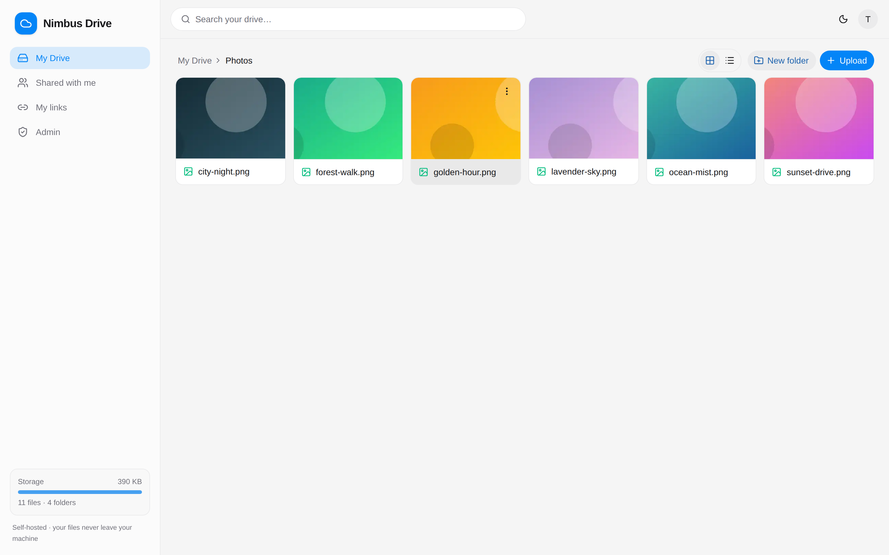

# ☁️ Nimbus Drive

Your own Google-Drive-style cloud — running on **your** computer, storing files on **your** disk, reachable from anywhere through a Cloudflare Tunnel, with **Google sign-in for exactly the people you allow**. No hosting bills, no third-party storage, no public files. Rename it to anything you like via `APP_NAME`.



## What it does

- **Files live on your disk.** The app serves a normal folder (`STORAGE_ROOT`). Paste files into it in Explorer/Finder and they appear in the web UI within seconds (file-watcher + live refresh) — and anything uploaded through the browser is just a normal file in that folder.
- **Google sign-in, allowlist only.** There are no passwords. Sign-in goes through Google OAuth, and after Google says who the person is, they must also be on *your* allowlist (managed in the Admin page) or they're turned away. **Everyone on the allowlist is family — they get full access to the whole drive.** Removing someone signs them out everywhere instantly.
- **Private by default.** Every byte (files, previews, even thumbnails) streams through an access-checked API. The one exception is a **public link** you deliberately create for a specific item (below) — everything else stays behind Google sign-in.
- **Drive-like UI.** Folder browsing, drag-and-drop **file *and* folder** uploads with progress, **multi-select** for bulk download / move / delete, grid/list views, image thumbnails, previews (images, video with seeking, audio, PDF, text), rename, move, zip-download, search, dark mode — and it's **installable as an app** (PWA) on phone or desktop.
- **Public links (no login).** Turn any file or folder into a read-only link that **anyone can open without signing in** — handy for sending something to a relative who isn't on the drive. Optional expiry, revoke anytime, manage them all under **Links**. Deleting a file kills its links; renaming keeps them working.
- **Trash you can actually use.** Deleted items go to **Trash** in the sidebar — restore them to where they came from, or delete forever / empty the trash when you're sure.
- **Admin activity log.** The owner and admins see who signed in and who uploaded, downloaded, previewed, renamed, moved or deleted what — with timestamps — filterable by person or action.
- **Runs on any machine.** Windows, macOS, Linux, or Docker. One `.env` file holds everything machine-specific.

## The stack

Next.js (App Router) + HeroUI + Tailwind for the frontend · Express 5 + SQLite (better-sqlite3) + chokidar + sharp for the backend · Cloudflare Tunnel to go public without opening ports or renting a server.

```
┌─────────────┐     https      ┌────────────┐  proxy   ┌─────────────┐
│  any device │ ─────────────▶ │  Next.js   │ ───────▶ │ Express API │
│  (browser)  │  Cloudflare    │  web  :3000│  /api/*  │  :4400      │
└─────────────┘    Tunnel      └────────────┘          │  ├ SQLite   │
                                                       │  ├ watcher  │
                                    your PC ──────────▶│  └ STORAGE_ │
                                 (paste files in)      │     ROOT 📁 │
                                                       └─────────────┘
```

## Quick start (local)

```bash
npm run install:all   # installs root + server + web dependencies
npm run setup         # interactive wizard → writes .env  (needs Google OAuth keys, see SETUP.md §2)
npm run build         # builds the web app once
npm start             # runs API + web  →  http://localhost:3000
```

Sign in with the Google account you set as `ADMIN_EMAIL` — you're the owner. Add everyone else in **Admin → Allowlist**.

Prefer **no terminal at all**? There's a desktop app that does everything — on a brand-new PC it's a single `Setup.exe` from this repo's Releases page that downloads the code, installs its own Node runtime, builds, walks through setup, runs the drive in the tray, and one-click updates itself from Releases (with rollback). See **[DESKTOP.md](DESKTOP.md)**.

**[SETUP.md](SETUP.md)** has the full walkthrough: creating the Google OAuth keys, going public with a Cloudflare Tunnel + your domain, auto-start on boot, Docker, moving machines, troubleshooting.

## Project layout

```
nimbus-drive/
├─ .env                 ← the only machine-specific file (create with `npm run setup`)
├─ server/              ← Express API: auth, files, shares, admin, watcher
├─ web/                 ← Next.js app: the Drive UI
├─ scripts/setup.mjs    ← interactive .env wizard
├─ scripts/dev/         ← mock Google + full e2e test suite (`npm run test:e2e`)
├─ cloudflared/         ← tunnel config template
├─ ecosystem.config.cjs ← PM2: keep it running / start on boot
├─ Dockerfile + docker-compose.yml
├─ storage/             ← your files (default; move it anywhere via .env)
└─ data/                ← SQLite DB, thumbnail cache, trash
```

## Good to know

- **Trash, not delete.** Deleting moves things to `data/trash`; restore or purge them from the **Trash** page — or set `TRASH_ENABLED=false` for hard deletes.
- **Backups** = copy two folders: your storage folder and `data/`. That's the whole state (files, allowlist, links, activity log).
- **Offline behavior:** on your LAN everything keeps working except *new* Google sign-ins (existing sessions live `SESSION_TTL_DAYS`); reaching the app by its LAN IP works for uploads and edits too. The public URL needs the tunnel up. Installed as a PWA, the shell opens offline.
- **Self-check:** `npm run test:e2e` boots the whole backend against a mock Google and runs ~60 checks (auth, family access, uploads, public links, trash, activity, security, watcher) in under 30 seconds. Run it after any change.
